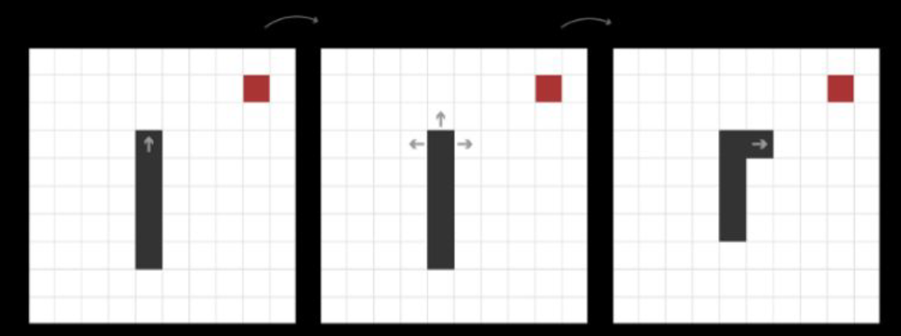
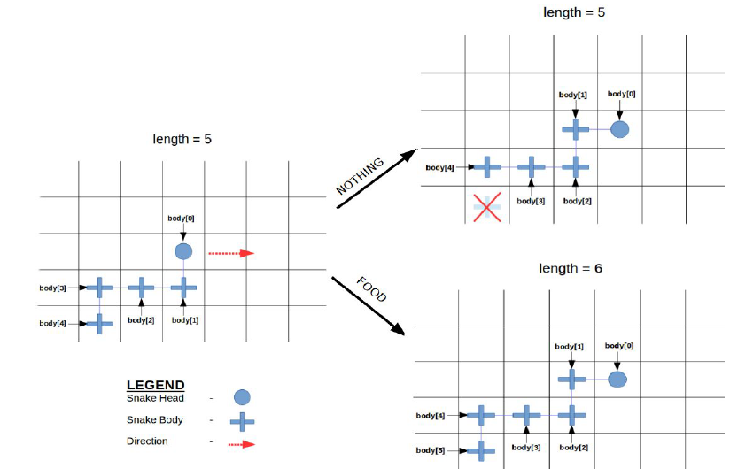

# Snake-Game
## INTRODUCTION
----------------------------
* I’ve developed the game called 'snake' in C language .
* This game has been around since the earliest days of home computing and has re-emerged in recent years on mobile phones.
* It isn't the world's greatest game, but it does give you an idea of what you can achieve with a relatively simple C program, and perhaps the basis by which to extend the principles and create more interesting games of your own.

## RULES
----------------------------
Snake has simple rules:
1. The world is a grid.
2. The snake can only travel orthogonally along this grid.
3. This world has a border that kills the snake on contact in medium and
hard mode.
4. The snake cannot stop moving.
5. If the snake runs into itself, it dies.
6. Every time the snake eats, it grows longer.
7. The goal is to grow as long as possible.

## IDEA OF PLAYING THE GAME
----------------------------
* When playing the game, there is a decision to make each time the snake takes a step forward: continue straight, turn left, or turn right.
* First assessing the state of the world that the snake lives in, then choosing the move that will keep it alive and continue to grow longer.

## MOVEMENTS OF THE SNAKE
----------------------------

## MODES
----------------------------
Different modes in the game:
1. BEGINNER
2. EASY
3. MEDIUM
4. HARD

